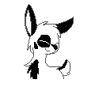

<h1 align="center">Sup. <code>@mrsobakin</code>'s here. 👋</h1>

<picture><source media="(prefers-color-scheme: dark)" srcset="assets/dogsiftheywerepurple.svg"><source media="(prefers-color-scheme: light)" srcset="assets/dogsiftheywerepurple.svg"></picture>

## 🤔 Who am I?

- 🦀 Rust enjoyer

- ⚡ Async deadlocks virtuoso

- 🌐 Network protocols enthusiast

- 👾 Reverse (and forward 😉) Engineer

- 😎 239% Pretentious

Feel free to contact me on [ Telegram](https://t.me/sbknnn).

## 🔧 Tools that I use: 

<picture><source media="(prefers-color-scheme: dark)" srcset="assets/arch.svg"><source media="(prefers-color-scheme: light)" srcset="assets/arch.svg"></picture>
<picture><source media="(prefers-color-scheme: dark)" srcset="assets/linux.svg"><source media="(prefers-color-scheme: light)" srcset="assets/linux.svg"></picture>
<picture><source media="(prefers-color-scheme: dark)" srcset="assets/i3.svg"><source media="(prefers-color-scheme: light)" srcset="assets/i3.svg"></picture>
<picture><source media="(prefers-color-scheme: dark)" srcset="assets/alacritty.svg"><source media="(prefers-color-scheme: light)" srcset="assets/alacritty.svg"></picture>
<a href="https://github.com/mrsobakin?tab=repositories&q=&type=&language=rust"><picture><source media="(prefers-color-scheme: dark)" srcset="assets/rust.svg"><source media="(prefers-color-scheme: light)" srcset="assets/rust_light.svg"></picture></a>
<a href="https://github.com/mrsobakin?tab=repositories&q=&type=&language=c%2B%2B"><picture><source media="(prefers-color-scheme: dark)" srcset="assets/cpp.svg"><source media="(prefers-color-scheme: light)" srcset="assets/cpp.svg"></picture></a>
<a href="https://github.com/mrsobakin?tab=repositories&q=&type=&language=python"><picture><source media="(prefers-color-scheme: dark)" srcset="assets/python.svg"><source media="(prefers-color-scheme: light)" srcset="assets/python.svg"></picture></a>
<a href="https://github.com/mrsobakin?tab=repositories&q=&type=&language=go"><picture><source media="(prefers-color-scheme: dark)" srcset="assets/go.svg"><source media="(prefers-color-scheme: light)" srcset="assets/go.svg"></picture></a>
<a href="https://github.com/mrsobakin?tab=repositories&q=&type=&language=javascript"><picture><source media="(prefers-color-scheme: dark)" srcset="assets/javascript.svg"><source media="(prefers-color-scheme: light)" srcset="assets/javascript.svg"></picture></a>
<a href="https://github.com/mrsobakin?tab=repositories&q=&type=&language=java"><picture><source media="(prefers-color-scheme: dark)" srcset="assets/java.svg"><source media="(prefers-color-scheme: light)" srcset="assets/java.svg"></picture></a>
<picture><source media="(prefers-color-scheme: dark)" srcset="assets/sqlite.svg"><source media="(prefers-color-scheme: light)" srcset="assets/sqlite.svg"></picture>
<a href="https://github.com/mrsobakin/scripts"><picture><source media="(prefers-color-scheme: dark)" srcset="assets/bash.svg"><source media="(prefers-color-scheme: light)" srcset="assets/bash_light.svg"></picture></a>
<picture><source media="(prefers-color-scheme: dark)" srcset="assets/lua.svg"><source media="(prefers-color-scheme: light)" srcset="assets/lua.svg"></picture>
<picture><source media="(prefers-color-scheme: dark)" srcset="assets/docker.svg"><source media="(prefers-color-scheme: light)" srcset="assets/docker.svg"></picture>
<picture><source media="(prefers-color-scheme: dark)" srcset="assets/git.svg"><source media="(prefers-color-scheme: light)" srcset="assets/git.svg"></picture>
<picture><source media="(prefers-color-scheme: dark)" srcset="assets/github.svg"><source media="(prefers-color-scheme: light)" srcset="assets/github_light.svg"></picture>
<picture><source media="(prefers-color-scheme: dark)" srcset="assets/nvim.svg"><source media="(prefers-color-scheme: light)" srcset="assets/nvim.svg"></picture>
<picture><source media="(prefers-color-scheme: dark)" srcset="assets/md.svg"><source media="(prefers-color-scheme: light)" srcset="assets/md_light.svg"></picture>
<picture><source media="(prefers-color-scheme: dark)" srcset="assets/regex.svg"><source media="(prefers-color-scheme: light)" srcset="assets/regex_light.svg"></picture>
<picture><source media="(prefers-color-scheme: dark)" srcset="assets/ffmpeg.svg"><source media="(prefers-color-scheme: light)" srcset="assets/ffmpeg.svg"></picture>
<picture><source media="(prefers-color-scheme: dark)" srcset="assets/wine.svg"><source media="(prefers-color-scheme: light)" srcset="assets/wine_light.svg"></picture>
<picture><source media="(prefers-color-scheme: dark)" srcset="assets/gimp.svg"><source media="(prefers-color-scheme: light)" srcset="assets/gimp.svg"></picture>
<picture><source media="(prefers-color-scheme: dark)" srcset="assets/arduino.svg"><source media="(prefers-color-scheme: light)" srcset="assets/arduino.svg"></picture>
<picture><source media="(prefers-color-scheme: dark)" srcset="assets/react.svg"><source media="(prefers-color-scheme: light)" srcset="assets/react.svg"></picture>
<picture><source media="(prefers-color-scheme: dark)" srcset="assets/fastapi.svg"><source media="(prefers-color-scheme: light)" srcset="assets/fastapi.svg"></picture>
<picture><source media="(prefers-color-scheme: dark)" srcset="assets/flask.svg"><source media="(prefers-color-scheme: light)" srcset="assets/flask_light.svg"></picture>
<picture><source media="(prefers-color-scheme: dark)" srcset="assets/qemu.svg"><source media="(prefers-color-scheme: light)" srcset="assets/qemu.svg"></picture>
<picture><source media="(prefers-color-scheme: dark)" srcset="assets/wireshark.svg"><source media="(prefers-color-scheme: light)" srcset="assets/wireshark_light.svg"></picture>
<picture><source media="(prefers-color-scheme: dark)" srcset="assets/mitmproxy.svg"><source media="(prefers-color-scheme: light)" srcset="assets/mitmproxy.svg"></picture>
<picture><source media="(prefers-color-scheme: dark)" srcset="assets/minecraft.svg"><source media="(prefers-color-scheme: light)" srcset="assets/minecraft.svg"></picture>
<picture><source media="(prefers-color-scheme: dark)" srcset="assets/spigot.svg"><source media="(prefers-color-scheme: light)" srcset="assets/spigot.svg"></picture>

